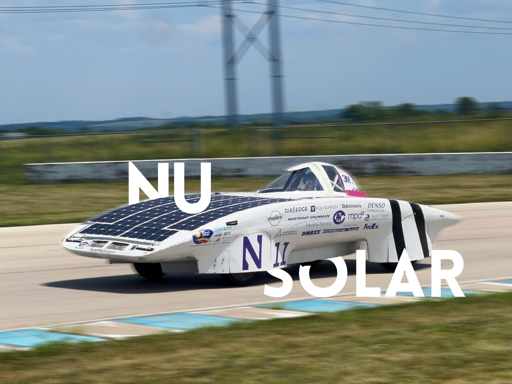

# Introduction

Welcome to the Northwestern Solar Car Software team!

This handbook contains training tutorials and documentation for Fall 2023.
Training will roughly follow the chapters in this book as they appear, but
we may jump between sections as needed. There may be more information here
than gets covered explicitly during training sessions; the goal is for this
handbook to a be a valuable reference for new members.

## Training Road Map

There's a lot to learn about our telemetry system—but don't worry! This
handbook assumes no prior programming experience or familiarity with the
hardware we use. Generally, many new members do enter with some programming
background, so we may move faster through some chapters in practice.

As part of this training, you'll build a simple pipeline for processing
telemetry data from our solar car. You'll construct this pipeline from the
ground up, understanding each step in the life cycle of a given piece of data.

* First, you'll learn about the CAN standard for device communication on
automobiles. At this level, telemetry data is electrical traffic on a network
of wires.
* Next, you'll work with different data representations and try your hand
at manually parsing collections of bytes known as CAN frames.
* With that done, you'll automate the CAN parsing process with Python. At
this point, telemetry data exists as objects in memory.
* Next, you'll learn how to persist data in an SQL database for long term
storage.
* Finally, you'll adapt your pipeline to receive data over an XBee radio
network.

Along the way, you'll pick up some skills applicable to programming in general,
including working on the command line, developing remotely with SSH, using
Git to collaborate with others, organizing code with virtual environments,
working with package managers, and more. 

We'll end the training with an introduction to the current telemetry system
and the projects we have planned for this year.

Training is expected to last roughly a month, but may be shorter or longer
depending on member feedback. Simultaneous to training sessions following
this handbook, more "hands-on" meetings will be taking place to introduce
new members to the telemetry system in action.

## Getting Help

Software is a small team, and every member should feel welcome and comfortable
contributing to the project. If you have any concerns about training or the team
in general, please reach out to Matthew Sinclair (Software Lead), Alexander
Sorensen (Project Lead), or any other member of the solar car team. New members
are the future of this organization, and we all want you to succeed!

## Contributing

Want to add something to this handbook? The files for this site are publicly
available at
[github.com/nusolar/training-f23](https://github.com/nusolar/training-f23).
Submit a pull request with your proposed changes (see the
[Git and GitHub](tools/git.md) chapter to learn how).

