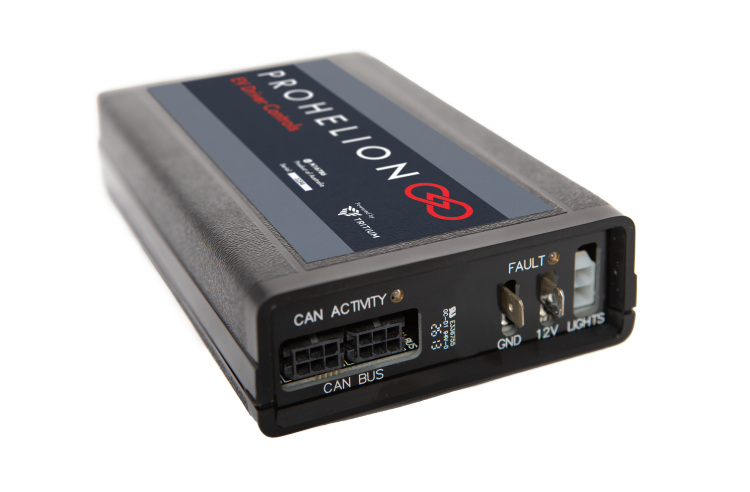

# Prohelion EV Driver Controls

Prohelion's EV Driver Controls is the device responsible for controlling the
motor controllers. Details can be found in the
[user's manual](../hardware/driver-controls.pdf). You'll notice that the manual
does not specify the device's CAN broadcast messages. This is because, like the
BMS, this device is programmable. The current settings define the following CAN
frames:

### ID Info

Frame ID: Base address + 0x0

| Variable      | Bytes | Type     | Description                                    |
| ------------- | ----- | -------- | ---------------------------------------------- |
| Tritium ID    | 0-3   | `Uint32` | Device identifier                              |
| Serial Number | 4-7   | `Uint32` | Device serial number, allocated at manufacture |

### Drive

Frame ID: Base address + 0x1

| Variable                 | Bytes | Type      | Description                             |
| ------------------------ | ----- | --------- | --------------------------------------- |
| Set point Motor Velocity | 0-3   | `Float32` | Desired motor velocity set point in rpm |
| Set point Motor Current  | 4-7   | `Float32` | Desired motor current set point as a percentage of maximum current setting |

### Power

Frame ID: Base address + 0x2

| Variable              | Bytes | Type      | Description                             |
| --------------------- | ----- | --------- | --------------------------------------- |
| Reserved              | 0-3   | -         | -                                       |
| Set point Bus Current | 4-7   | `Float32` | Desired set point of current drawn from the bus by the controller as a percentage of absolute bus current limit |

### Reset

Frame ID: Base address + 0x3

| Variable | Bytes | Type | Description |
| -------- | ----- | ---- | ----------- |
| Unused   | 0-3   | -    | -           |
| Unused   | 4-7   | -    | -           |

### Switch

Frame ID: Base address + 0x5

| Variable       | Bit(s) | Type     | Description                                                               |
| -------------  | ------ | -------- | ------------------------------------------------------------------------- |
| Mode reverse   | 0     | `Bool`   | Car is in reverse mode if set                                              |
| Mode neutral   | 1     | `Bool`   | Car is in neutral mode if set                                              |
| Mode regen     | 2     | `Bool`   | Car is regenerating power from the motor if set                            |
| Mode drive     | 3     | `Bool`   | Car is in drive mode if set                                                |
| Ignition Accessories | 4 | `Bool`  | Ignition key is in the accessories position                               |
| Ignition Run   | 5     | `Bool`   | Ignition key is in the run position                                        |
| Ignition Start | 6     | `Bool`   | Ignition key is in the start position                                      |
| Brake          | 7     | `Bool`   | Brake pedal is currently being pressed if set                              |
| Charge Port    | 8     | `Bool`   | Charge port is currently open if set; port must be closed for car to drive |
| Unused         | 9-40  | -        | -                                                                          |
| Flags          | 48-55 | `Uint8`  | Flags currently being reported by the Driver Controller (check the code for more details) |
| State          | 56-63 | `Uint8`  | Latest state as being reported by the Driver Controller (check the code for more detail on valid states) |

