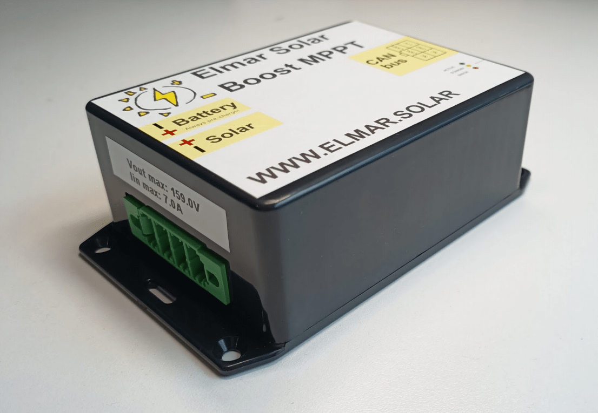

# Elmar Solar MPPT

The Elmar Solar MPPTs are responsible for managing power drawn from
the solar cells on the car. The CAN frame specification can be found
on pp.6-7 of the [datasheet](../pdfs/mppt.pdf).
