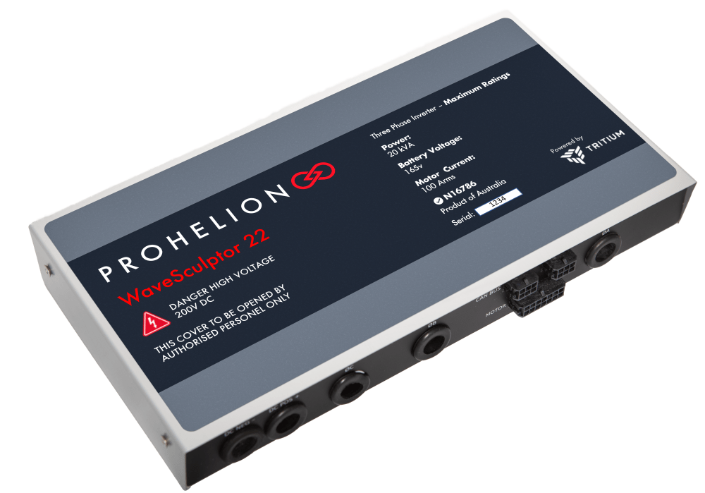

# Tritium WaveSculptor 22 Motor Controller

The Tritium WaveSculptor 22 is the motor drive responsible for controlling
the solar car's motors. The CAN frame specification can be found on pp.28-35
of the [user's manual](../pdfs/WaveSculptor22.pdf).
