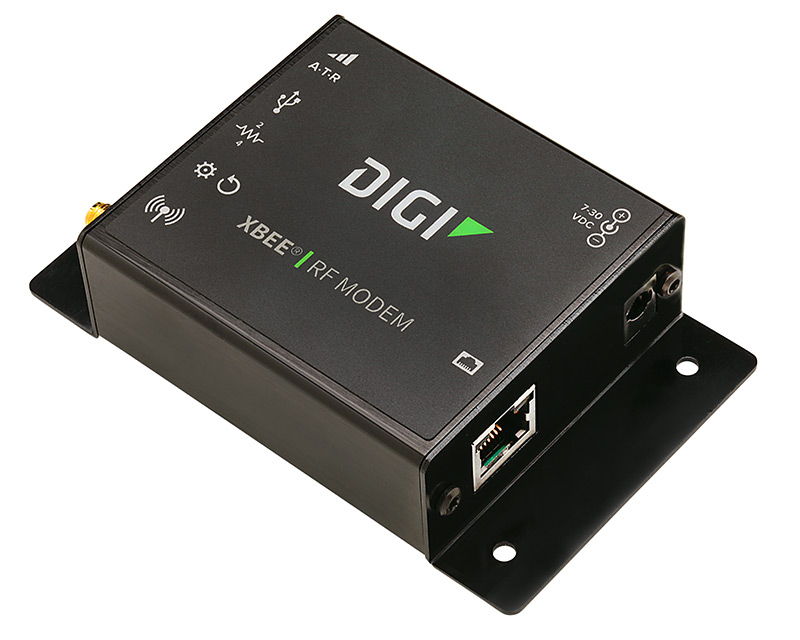

# Digi XBee® SX 1-Watt 900 MHz RF

The Digi XBee RF modems are the wireless transmitters that allow for
communication between the car and the base station. We have two XBee
devices:

| Device ID | Baud Rate (bits per second) |
| --------- | --------------------------- |
| Router    | 9600                        |
| Node      | 57600                       |

Each XBee is limited to sending no more than 256 bytes of data per message.

Information for controlling XBee with Python can be found in the
[documentation for the XBee Python Library](https://xbplib.readthedocs.io/en/latest/).
Which is available on PyPI as the [digi-xbee](https://pypi.org/project/digi-xbee/)
package.
