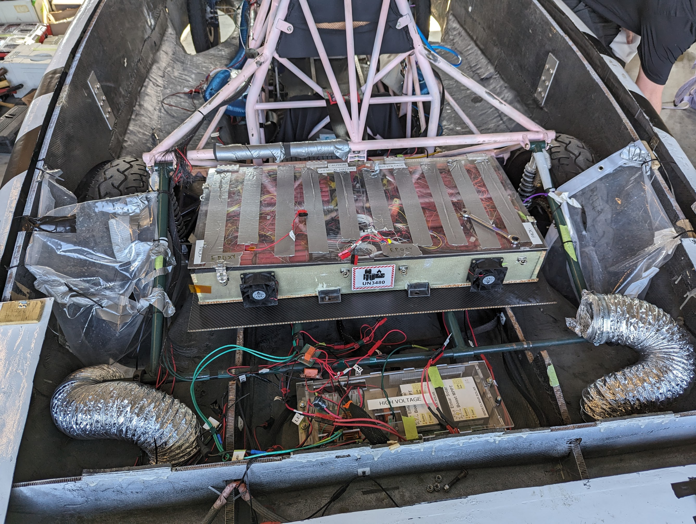

# Current in a wire

At the most fundamental level, telemetry data exists as electrical signals propagating
through a circuit. The exact way that wires are composed with resistors, batteries,
motor controllers, MPPTs, etc. in a way that makes our solar car function is complex,
but it's largely the domain of the Electrical team.

 

<i>SC7s internals</i>

Much of the details at this level are not essential for the Software team to know,
but two facts are particularly relevant:

1. There exists a circuit in the solar car on which all the electrical devices are
connected and communicate, and traffic on this circuit can be monitored. This is
the *raison d'être* of the Software team; our job is fundamentally based on
processing this traffic.
2. This circuit follows the Controller Area Network (CAN bus) standard, which is
a protocol commonly used in automobiles. The protocol defines certain electrical
properties (e.g. the charactereistic impedance of the transmission line) that,
when met, allow devices on the network to communicate with minimal errors and
noise. Again, this is largely Electrical's domain, but what's important for
Software is the format of messages sent on this line. Before we get into that
though (see [CAN frames](../step-1/can-frames.md)), we need to introduce data
representations.

In the next chapter, you'll learn how to represent electrical signals as streams
of bytes and interpret CAN frames.

