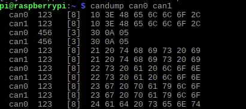

# A stream of bytes

Thinking of telemetry data as signals in a wire is difficult. If we want
to make sense of it, we need a better way to represent it. In this chapter,
you'll learn how to format data in binary and hexadecimal, how to represent
electrical signals as streams of bytes, and how to interpret individual
CAN frames.

    
     
    <i>Traffic on a CAN bus</i>

