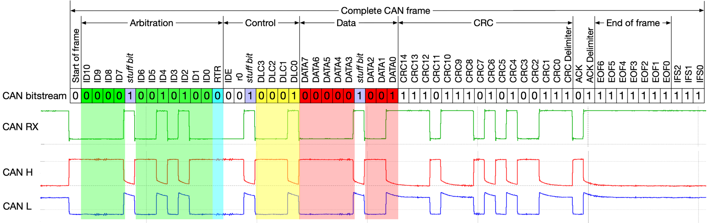
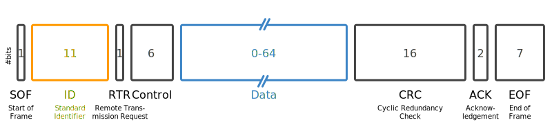

# CAN frames

As mentioned in [Chapter 2](../step-0), the CAN bus is the network on which all
the solar car's components communicate with one another. Messages sent on this
network are called CAN frames.

<i>The electrical view of a CAN bus frame</i>

 

   

<i>A simplified view of a CAN bus frame</i>

As shown above, many of this bits in a frame are responsible for ensuring reliable
and orderly transmission on the line (e.g. the 16 bits for the cylic redundancy check).
These details are largely unimportant for Software. For our purposes, a CAN frame is
composed of two parts: the frame ID and the data.

* __Frame ID__: The frame ID (also called arbitration ID, message ID, standard identifier,
or simply ID) is comprised of 11 bits and is responsible for identifying the sender of
the CAN frame and the type of values contained within. For example, on a given CAN network,
a frame ID of 0x403 might correspond to velocity measurement message from one motor
controller, an ID of 0x413 might correspond to the same message from another motor
controller, and an ID of 0x602 might indicate a temperature measurement message from an
MPPT.
* __Data__: Up to 64 bits of a CAN frame contain the actual values of some signal. This
is the core of the message.

In the next section you'll learn more about CAN frames as you try your hand at decoding
them yourself.
