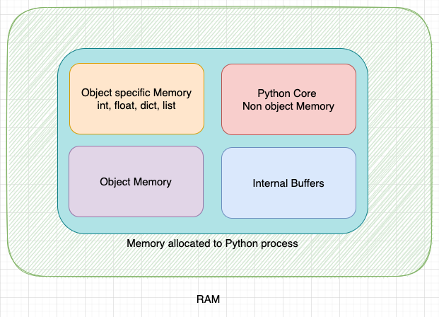

# An object in memory

Now that you've had a chance to decode a couple CAN frames by hand, you can probably
agree that manually fiddling with bits and bytes is a slow and tedious process.
Considering that dozens of frames will be sent on the car's CAN bus every second,
we're going to need a way to automate the decoding.

In this chapter, you will build the foundation of a telemetry processing pipeline
with Python. Raising the level of abstraction from bytes to Python objects, you
will be able to process hundreds of CAN messages in the blink of an eye. At the end
of the chapter, you will use your new program to pinpoint the cause of an electrical
failure in a fictional post-mortem on the car.

    
     
    <i>Python memory</i>

