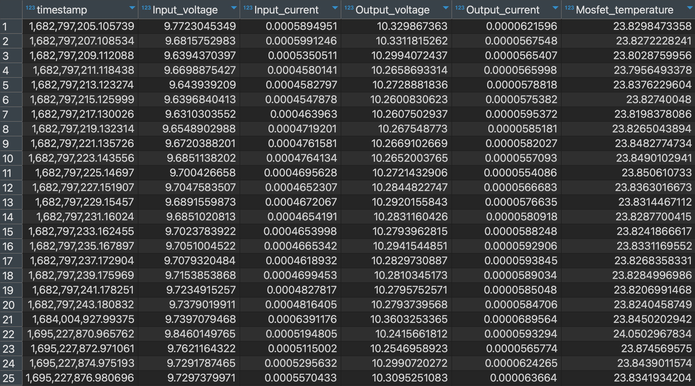

# A row in a table

So far, you've learned how to parse messages on a CAN network. You've decoded some
by hand and built a Python program to automatically decode thousands of frames in
the blink of an eye—and you've used those skills to identify a failure in a CAN
traffic dump. Well done!

But all the decoded traffic you've made so far has disappeared each time your
program exited. That's fine if you've been given a CAN traffic log that you
can simply re-process again later, but, in a live system, decoded messages need
to be stored for later analysis. We need a way to persist data.

 

    
     
    <i>A table of parsed CAN traffic</i>

In this chapter, you'll expand your telemetry processing pipeline to store parsed
CAN traffic in an SQL database.
