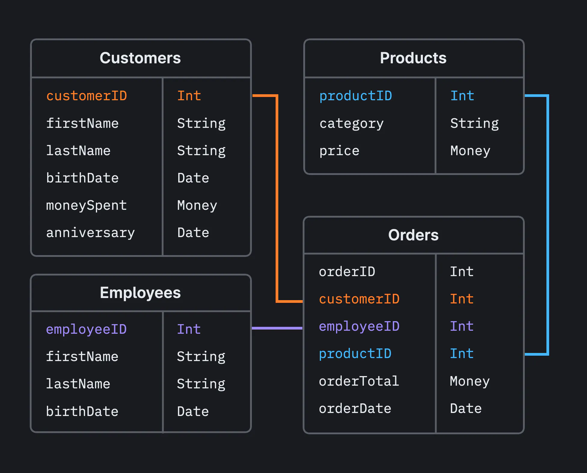

# SQL

Structured Query Language (SQL) is domain-specific programming language for
working with relational databases. A database is any organized collection
of data; a relational database is one where the data inside adheres to
certain mathematical "relations" which permit the operations of "relational
algebra." The underlying math is unimportant for our needs, but you should be
aware of the following points:

* Relational databases are just one of the many possible choices for database
structure. Relational databases are old and well-established, but other types
(e.g. document databases) have been growing in popularity. In particular,
time-series databases like [InfluxDB](https://www.influxdata.com/) could be
a reasonable choice for our telemetry system.
* Even with the relational database category, there are multiple engines to
choose from, including PostgreSQL, MySQL, Microsoft SQL Server, SQLite, etc.
* Almost all types of databases operate around the idea of a "table". Tables
are where you actually store the data in the database; each table associates
its columns with the data in its rows.
* SQL is a language for managing relational databases. It is not a general
purpose programming language like Python—it is not meant to be used for
arbitrary computations. And although there are many advanced features of SQL
that database engineers leverage, we only ever use a very small subset of
SQL in our system.

    
    <i>Example schema for a relational database</i>

