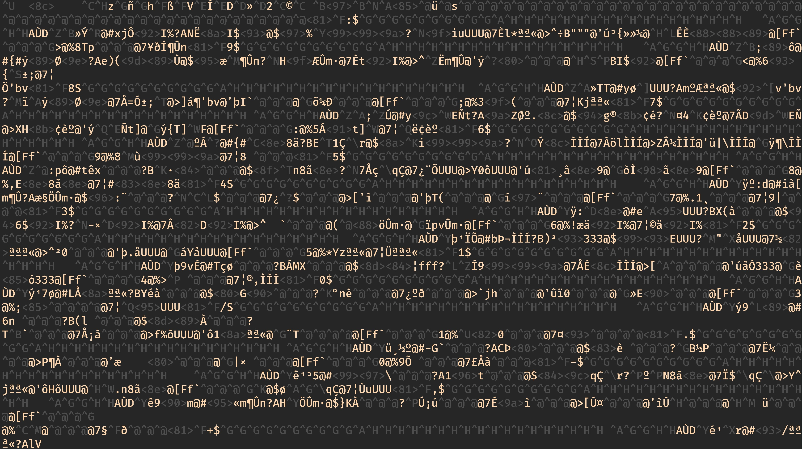

# Setting up

We're going to use SQLite as the database engine of choice for this training.
SQLite is simple and free, and libraries for SQLite exist for many programming
languages. In Python, SQLite bindings ship with the standard library, so you
should already have everything installed.

Check that SQLite is available by running the following Python script:

```python
import sqlite3
```

If you get an error, you are using a build of Python without SQLite support.

## Viewing SQLite databases
SQLite databases are stored as files on disk typically with the extension ".db".
These files, however, are not human-readable; if you open a ".db" file in a minimal
text editor, you will see a mess a random characters.

<br/>

<p align="center">
    
    <br/>
    <i>Viewing an SQLite database file without the right plugin</i>
</p>

Although you can always use Python to read the data out of this file, it's nice to
be able to open a database interactively in a text editor or other application.
If you are using VSCode as your text editor, there is a
[plugin for SQLite](https://marketplace.visualstudio.com/items?itemName=alexcvzz.vscode-sqlite)
that should let you view tables right inside the editor. Similar plugins exist for other
text editors and IDEs (some IDEs may come with this behavior out of the box).

If you find yourself working with many types of databases often, you should consider installing
a database management application, like [DBeaver](https://dbeaver.io/).
