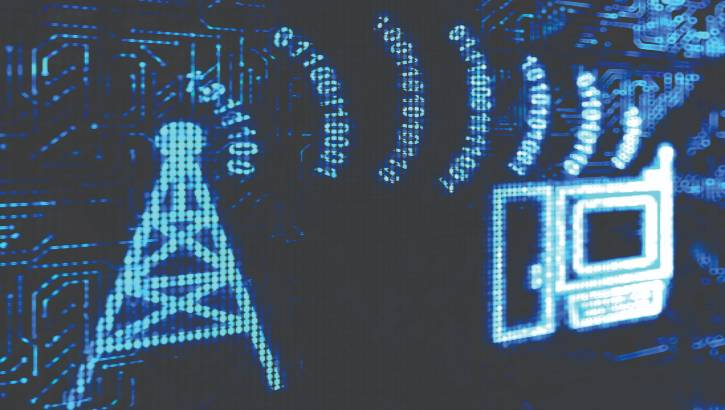

# A stream of bytes, revisited

In Chapter 3, we discussed how CAN data is initially nothing more than
a stream of bytes sent on an electrical transmission line. You then
learned how to decode that data into Python objects and store it inside
of SQL tables. But to complete this simplified telemetry pipeline, we'll
need to revisit the idea of byte-streams to understand how data is
transferred from the car to the base-station.

Messages sent over our XBee wireless transmitters are packets of no more than
256 bytes. These messages are not Python objects or SQL tables—they are just
bytes. This means that any Python representation of a decoded CAN message must
be *serialized* into a stream of bytes, sent over the radio network, and then
*deserialized* back into a Python object on the receiving end. This is what we
have to do in our current pipeline.

But since having you serialize and deserialize Python objects is more trouble
than its worth for training, you will adapt your pipeline to simply accept CAN
frames (which you already know how to handle as bytes) from the receiving end
of the network instead of from a file. Still, you should be aware that
(de)serialization is always at play whenever data structures need to be transferred
between different environments.
