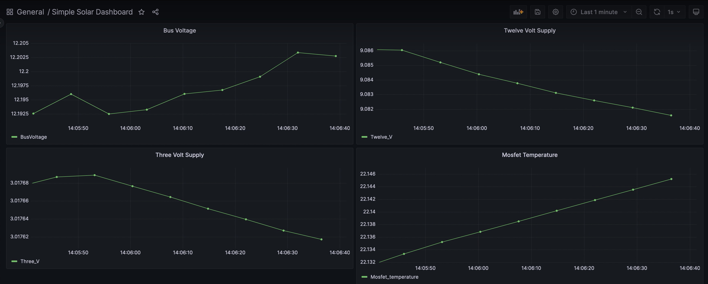

# Our purpose

The Software team's main responsibility is to monitor telemetry data coming
from the solar car, including, for example, the state of charge of cells in the
battery box, the amount current being delivered to the MPPTs, the temperature
in the motor controllers, and much more. While Mechanical and Electrical are the
teams that actively build the car's structure and its circuitry, Software's
role is nevertheless fundamental. By tracking telemetry data, we allow the
team to:
* Diagnose issues with the electrical components on the car during development.
* Monitor relevant information during a race both from a remote dashboard and an onboard
display.
* Predict failure and investigate their causes when they occur.
* Persist telemetry signals in a database for later analysis.
* Make more informed decisions about race strategy and future design cycles.

 

<i>A basic telemetry dashboard</i>

