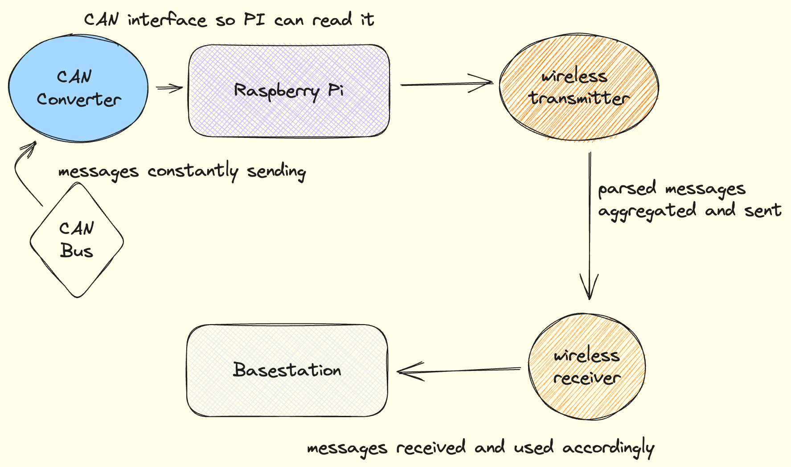

# Data flow

Now that you've built your own simplified telemetry processing pipeline
as part of training, it's time to introduce the actual system currently
in use.

 

<i>Overview of the telemetry pipeline</i>

The overview of data flow in the actual pipeline should be familiar to
you, as it's largely similar to the training pipeline:

* CAN messages begin as bytes circulating on the CAN Bus.
* These messages are intercepted by a CAN converter on the Raspberry Pi,
where they are processed into Python objects.
* This data is transmitted to a remote base station.
* The data is persisted in SQL databases and displayed visually as part
of this process.

However, there are some key differences between the training system and
the real one:

1. We do not write the CAN decoding code ourselves, as you did in
[Section 4.2](../pipeline/step-2/exercise.md). We used to, but we've
since migrated to creating [DBC files](../pdfs/DBC_File_Format_Documentation.pdf)
(a file format for CAN network specification), which we use with
[cantools](https://cantools.readthedocs.io/en/latest/) to automatically
parse messages off the CAN Bus.

2. SQL databases are maintained both on the onboard Raspberry Pi and on
the remote base-station, whereas in the training system you only made
one database on one computer. Maintaining a database on the Raspberry Pi
(when technically only the remote database is necessary) serves as a
backup if connectivity is lost with the base-station.

3. CAN frames are parsed *before* they are sent to the base-station. This
is different than [Section 6.2](../pipeline/step-4/exercise.md), where you
accepted unprocessed CAN data on the receiving end of wireless transmitters.

4. CAN messages are not sent one at a time over the transmitters. Instead,
the code running on the Raspberry Pi maintains running averages of signal
values and sends them all at once every few seconds. We do this because
CAN frames are sent far more often than necessary for our purposes, and
we don't need to store and transmit every single message.
5. Processed data is presented to the driver with a simple onboard display.
On the base-station, we also display data, but with a more complex dashboard.
