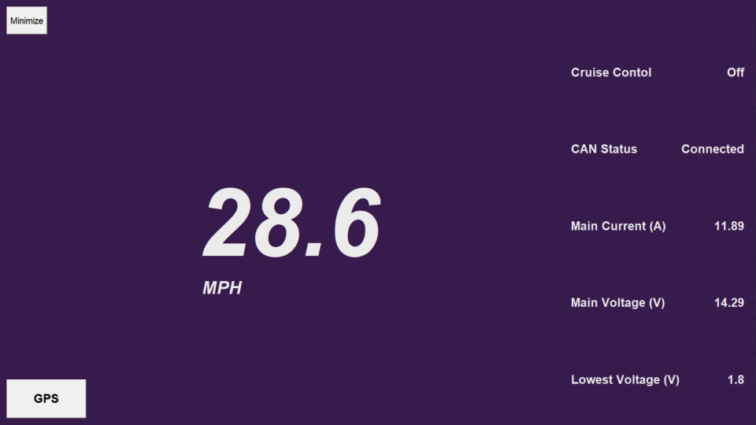

# Onboard Display

The onboard display runs on the Raspberry Pi and presents information
to the driver through the LCD screen.

<i>Onboard display</i>

This display is made with TKinter, a simple GUI toolkit that ships
with the Python standard library. You can learn more about TKinter
in the [official TK tutorial](https://tkdocs.com/tutorial/).
